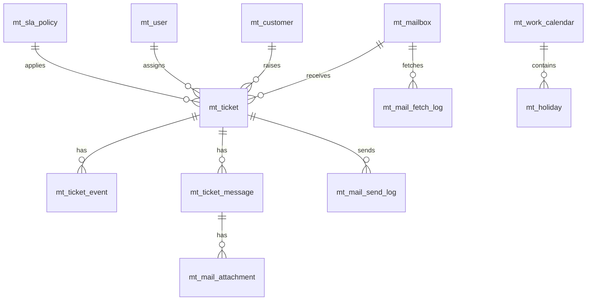

# MailTrace 邮迹工单 — 数据库设计

| 项目 | 说明 |
|------|------|
| 文档版本 | v0.2 |
| 编写日期 | 2026-07-22 |
| 数据库 | MySQL 8.0 |
| 字符集 | utf8mb4 / utf8mb4_unicode_ci |
| 产品名称 | MailTrace（邮迹工单） |
| 表前缀 | `mt_`（MailTrace，规则同 `kb_` 类前缀约定） |
| 配套文档 | [[邮件工单系统需求文档]]、[[项目架构与规范]] |

---

## 1. 设计规则

### 1.1 命名规则

| 规则 | 约定 | 示例 |
|------|------|------|
| 表前缀 | 统一 `mt_` | `mt_ticket` |
| 表名 | 小写 + 下划线 | `mt_mail_send_log` |
| 字段名 | 小写 + 下划线 | `ticket_no`、`created_at` |
| 主键 | `id`，`BIGINT` 自增 | |
| 外键字段 | `{表语义}_id` | `mailbox_id`、`assignee_id` |
| 布尔/开关 | `TINYINT(1)`，0否 1是 | `is_enabled`、`is_deleted` |
| 枚举状态 | `VARCHAR(32)` 存码值 | `status` = `PROCESSING` |

> 前缀说明：按项目约定「业务表必须加前缀」（如知识库 `kb_`）。本系统统一使用 **`mt_`**（MailTrace）。

### 1.2 注释规则（强制）

- **每张表**必须有 `COMMENT='...'`
- **每个字段**必须有 `COMMENT '...'`
- 注释写清业务含义，枚举字段注明可选值

### 1.3 可审计规则（强制）

业务表统一包含以下审计字段：

| 字段 | 类型 | 说明 |
|------|------|------|
| `created_by` | VARCHAR(64) NOT NULL | 创建人（账号或 SYSTEM） |
| `created_at` | DATETIME(3) NOT NULL | 创建时间 |
| `updated_by` | VARCHAR(64) NOT NULL | 最后更新人 |
| `updated_at` | DATETIME(3) NOT NULL | 最后更新时间 |
| `is_deleted` | TINYINT(1) NOT NULL DEFAULT 0 | 逻辑删除：0否，1是 |

补充约定：

- 系统自动任务写入时：`created_by` / `updated_by` 使用 `SYSTEM`
- 日志类流水表（拉取日志、发送日志、生命周期事件）以**追加为主**，仍保留审计字段；一般不做业务更新
- 查询默认过滤 `is_deleted = 0`

### 1.4 其他约定

| 项 | 约定 |
|----|------|
| 引擎 | InnoDB |
| 时间 | `DATETIME(3)`，应用层统一 Asia/Shanghai |
| 金额/敏感 | 邮箱密码等敏感字段加密后存储 |
| 索引 | 高频查询字段建索引；唯一业务键建 UNIQUE |
| 软删 | 统一 `is_deleted`，不做物理删除（特殊清理任务除外） |

---

## 2. 表清单（第一期）

| 序号 | 表名 | 说明 | 阶段 |
|------|------|------|------|
| 1 | `mt_user` | 系统用户（管理员/处理人） | 第一期 |
| 2 | `mt_customer` | 客户（邮箱轻量档案） | 第一期 |
| 3 | `mt_mailbox` | 客服邮箱与 IMAP/SMTP 配置 | 第一期 |
| 4 | `mt_ticket` | 工单主表 | 第一期 |
| 5 | `mt_ticket_event` | 工单生命周期事件 | 第一期 |
| 6 | `mt_ticket_message` | 工单邮件/消息往来 | 第一期 |
| 7 | `mt_mail_attachment` | 邮件附件元数据 | 第一期 |
| 8 | `mt_mail_fetch_log` | 邮件拉取任务日志 | 第一期 |
| 9 | `mt_mail_send_log` | 邮件发送日志（含重试） | 第一期 |
| 10 | `mt_assignment_rule` | 分配规则 | 第一期 |
| 11 | `mt_sla_policy` | SLA 策略 | 第一期 |
| 12 | `mt_work_calendar` | 工作日历 | 第一期 |
| 13 | `mt_holiday` | 节假日 | 第一期 |
| 14 | `mt_notification_template` | 通知/回执模板 | 第一期 |
| 15 | `mt_ticket_seq` | 工单号日流水 | 第一期 |
| 16 | `mt_sys_param` | 系统参数 | 第一期 |
| 17 | `mt_operation_log` | 操作审计日志 | 第一期 |
| 18 | `mt_job_log` | 定时任务执行日志 | 第一期 |

> 第三期报表不新增核心业务表，基于上述埋点字段聚合即可。

---

## 3. 实体关系概览



---

## 4. 枚举码值

### 4.1 工单状态 `mt_ticket.status`

| 码值 | 说明 |
|------|------|
| `PENDING_ASSIGN` | 待分配 |
| `PROCESSING` | 处理中 |
| `WAITING_CUSTOMER` | 待客户回复 |
| `CLOSED` | 已关闭 |
| `CANCELLED` | 已取消 |

### 4.2 生命周期事件 `mt_ticket_event.event_type`

| 码值 | 说明 |
|------|------|
| `CREATED` | 创建 |
| `AUTO_REPLY` | 自动回执 |
| `ASSIGNED` | 分配 |
| `FIRST_REPLY` | 首次响应 |
| `CUSTOMER_REPLY` | 客户追信 |
| `AGENT_REPLY` | 处理人回复 |
| `INTERNAL_NOTE` | 内部备注 |
| `SLA_WARNING` | SLA 预警 |
| `SLA_BREACHED` | SLA 超时 |
| `STATUS_CHANGED` | 状态变更 |
| `CLOSED` | 关闭 |
| `LINK_SUSPECT` | 疑似断链标记 |

### 4.3 消息方向 `mt_ticket_message.direction`

| 码值 | 说明 |
|------|------|
| `INBOUND` | 客户来信 |
| `OUTBOUND` | 系统/处理人外发 |
| `INTERNAL` | 内部备注（不对客户可见） |

### 4.4 发送类型 `mt_mail_send_log.send_type`

| 码值 | 说明 |
|------|------|
| `AUTO_REPLY` | 自动回执 |
| `ASSIGN_NOTIFY` | 分配通知 |
| `AGENT_REPLY` | 处理人回复 |
| `SLA_WARNING` | SLA 预警 |
| `SLA_BREACH` | SLA 超时提醒 |

### 4.5 发送状态 `mt_mail_send_log.send_status`

| 码值 | 说明 |
|------|------|
| `PENDING` | 待发送 |
| `SUCCESS` | 成功 |
| `FAILED` | 失败 |
| `RETRYING` | 重试中 |

---

## 5. 表结构详细设计（DDL）

> 以下 DDL 可直接作为 Flyway `V1__baseline.sql` 草案。

### 5.1 mt_user — 系统用户

```sql
CREATE TABLE `mt_user` (
  `id`              BIGINT       NOT NULL AUTO_INCREMENT COMMENT '主键ID',
  `account`         VARCHAR(64)  NOT NULL COMMENT '登录账号',
  `password_hash`   VARCHAR(128) NOT NULL COMMENT '密码哈希',
  `display_name`    VARCHAR(64)  NOT NULL COMMENT '显示名称',
  `email`           VARCHAR(128) NOT NULL COMMENT '用户邮箱（接收系统通知）',
  `role_code`       VARCHAR(32)  NOT NULL COMMENT '角色码：ADMIN管理员 / AGENT处理人',
  `is_enabled`      TINYINT(1)   NOT NULL DEFAULT 1 COMMENT '是否启用：0否，1是',
  `last_login_at`   DATETIME(3)           DEFAULT NULL COMMENT '最近登录时间',
  `created_by`      VARCHAR(64)  NOT NULL COMMENT '创建人',
  `created_at`      DATETIME(3)  NOT NULL DEFAULT CURRENT_TIMESTAMP(3) COMMENT '创建时间',
  `updated_by`      VARCHAR(64)  NOT NULL COMMENT '最后更新人',
  `updated_at`      DATETIME(3)  NOT NULL DEFAULT CURRENT_TIMESTAMP(3) ON UPDATE CURRENT_TIMESTAMP(3) COMMENT '最后更新时间',
  `is_deleted`      TINYINT(1)   NOT NULL DEFAULT 0 COMMENT '逻辑删除：0否，1是',
  PRIMARY KEY (`id`),
  UNIQUE KEY `uk_mt_user_account` (`account`),
  KEY `idx_mt_user_email` (`email`),
  KEY `idx_mt_user_role` (`role_code`)
) ENGINE=InnoDB DEFAULT CHARSET=utf8mb4 COLLATE=utf8mb4_unicode_ci COMMENT='系统用户表（管理员/处理人）';
```

### 5.2 mt_customer — 客户（轻量）

```sql
CREATE TABLE `mt_customer` (
  `id`              BIGINT       NOT NULL AUTO_INCREMENT COMMENT '主键ID',
  `email`           VARCHAR(128) NOT NULL COMMENT '客户邮箱（唯一标识）',
  `display_name`    VARCHAR(128)          DEFAULT NULL COMMENT '客户显示名（可从邮件解析）',
  `last_mail_at`    DATETIME(3)           DEFAULT NULL COMMENT '最近来信时间',
  `ticket_count`    INT          NOT NULL DEFAULT 0 COMMENT '关联工单数（冗余统计）',
  `remark`          VARCHAR(512)          DEFAULT NULL COMMENT '备注',
  `created_by`      VARCHAR(64)  NOT NULL COMMENT '创建人',
  `created_at`      DATETIME(3)  NOT NULL DEFAULT CURRENT_TIMESTAMP(3) COMMENT '创建时间',
  `updated_by`      VARCHAR(64)  NOT NULL COMMENT '最后更新人',
  `updated_at`      DATETIME(3)  NOT NULL DEFAULT CURRENT_TIMESTAMP(3) ON UPDATE CURRENT_TIMESTAMP(3) COMMENT '最后更新时间',
  `is_deleted`      TINYINT(1)   NOT NULL DEFAULT 0 COMMENT '逻辑删除：0否，1是',
  PRIMARY KEY (`id`),
  UNIQUE KEY `uk_mt_customer_email` (`email`)
) ENGINE=InnoDB DEFAULT CHARSET=utf8mb4 COLLATE=utf8mb4_unicode_ci COMMENT='客户轻量档案表（按邮箱去重，第一期只读展示）';
```

### 5.3 mt_mailbox — 邮箱配置

```sql
CREATE TABLE `mt_mailbox` (
  `id`                   BIGINT       NOT NULL AUTO_INCREMENT COMMENT '主键ID',
  `mailbox_name`         VARCHAR(64)  NOT NULL COMMENT '邮箱名称（展示用）',
  `email_address`        VARCHAR(128) NOT NULL COMMENT '客服邮箱地址',
  `is_enabled`           TINYINT(1)   NOT NULL DEFAULT 1 COMMENT '是否启用：0否，1是',
  `default_assignee_id`  BIGINT                DEFAULT NULL COMMENT '默认处理人用户ID',
  -- 收信 IMAP
  `imap_host`            VARCHAR(128) NOT NULL COMMENT 'IMAP服务器地址',
  `imap_port`            INT          NOT NULL DEFAULT 993 COMMENT 'IMAP端口',
  `imap_ssl_enabled`     TINYINT(1)   NOT NULL DEFAULT 1 COMMENT 'IMAP是否SSL：0否，1是',
  `imap_username`        VARCHAR(128) NOT NULL COMMENT 'IMAP用户名',
  `imap_password_enc`    VARCHAR(512) NOT NULL COMMENT 'IMAP密码密文（加密存储）',
  `imap_folder`          VARCHAR(64)  NOT NULL DEFAULT 'INBOX' COMMENT '收件文件夹',
  `fetch_interval_sec`   INT          NOT NULL DEFAULT 120 COMMENT '拉取间隔秒数',
  -- 发信 SMTP
  `smtp_host`            VARCHAR(128) NOT NULL COMMENT 'SMTP服务器地址',
  `smtp_port`            INT          NOT NULL DEFAULT 587 COMMENT 'SMTP端口',
  `smtp_ssl_enabled`     TINYINT(1)   NOT NULL DEFAULT 1 COMMENT 'SMTP是否加密：0否，1是',
  `smtp_username`        VARCHAR(128) NOT NULL COMMENT 'SMTP用户名',
  `smtp_password_enc`    VARCHAR(512) NOT NULL COMMENT 'SMTP密码密文（加密存储）',
  `smtp_from_name`       VARCHAR(64)           DEFAULT NULL COMMENT '发件人显示名',
  -- 自动回执
  `auto_reply_enabled`   TINYINT(1)   NOT NULL DEFAULT 1 COMMENT '是否启用自动回执：0否，1是',
  `auto_reply_template_id` BIGINT              DEFAULT NULL COMMENT '自动回执模板ID',
  `last_fetch_at`        DATETIME(3)           DEFAULT NULL COMMENT '最近成功拉取时间',
  `connection_status`    VARCHAR(32)  NOT NULL DEFAULT 'UNKNOWN' COMMENT '连接状态：UNKNOWN/OK/ERROR',
  `created_by`           VARCHAR(64)  NOT NULL COMMENT '创建人',
  `created_at`           DATETIME(3)  NOT NULL DEFAULT CURRENT_TIMESTAMP(3) COMMENT '创建时间',
  `updated_by`           VARCHAR(64)  NOT NULL COMMENT '最后更新人',
  `updated_at`           DATETIME(3)  NOT NULL DEFAULT CURRENT_TIMESTAMP(3) ON UPDATE CURRENT_TIMESTAMP(3) COMMENT '最后更新时间',
  `is_deleted`           TINYINT(1)   NOT NULL DEFAULT 0 COMMENT '逻辑删除：0否，1是',
  PRIMARY KEY (`id`),
  UNIQUE KEY `uk_mt_mailbox_email` (`email_address`),
  KEY `idx_mt_mailbox_enabled` (`is_enabled`)
) ENGINE=InnoDB DEFAULT CHARSET=utf8mb4 COLLATE=utf8mb4_unicode_ci COMMENT='客服邮箱配置表（IMAP收信/SMTP发信）';
```

### 5.4 mt_ticket — 工单主表

```sql
CREATE TABLE `mt_ticket` (
  `id`                       BIGINT       NOT NULL AUTO_INCREMENT COMMENT '主键ID',
  `ticket_no`                VARCHAR(32)  NOT NULL COMMENT '工单号/traceID，如TCK-20260722-0001',
  `subject`                  VARCHAR(512) NOT NULL COMMENT '工单主题（通常来自邮件主题）',
  `status`                   VARCHAR(32)  NOT NULL COMMENT '状态：PENDING_ASSIGN/PROCESSING/WAITING_CUSTOMER/CLOSED/CANCELLED',
  `priority`                 VARCHAR(16)  NOT NULL DEFAULT 'NORMAL' COMMENT '优先级：LOW/NORMAL/HIGH/URGENT',
  `mailbox_id`               BIGINT       NOT NULL COMMENT '来源邮箱ID',
  `customer_id`              BIGINT                DEFAULT NULL COMMENT '客户ID',
  `customer_email`           VARCHAR(128) NOT NULL COMMENT '客户邮箱（冗余，便于查询）',
  `assignee_id`              BIGINT                DEFAULT NULL COMMENT '当前处理人用户ID',
  `link_suspect`             TINYINT(1)   NOT NULL DEFAULT 0 COMMENT '是否疑似断链建单：0否，1是',
  `first_reply_at`           DATETIME(3)           DEFAULT NULL COMMENT '首次对外响应时间（内部备注不算）',
  `closed_at`                DATETIME(3)           DEFAULT NULL COMMENT '关闭时间',
  `sla_policy_id`            BIGINT                DEFAULT NULL COMMENT '命中的SLA策略ID',
  `sla_response_deadline`    DATETIME(3)           DEFAULT NULL COMMENT '首次响应SLA截止时间',
  `sla_resolve_deadline`     DATETIME(3)           DEFAULT NULL COMMENT '解决SLA截止时间',
  `sla_breached`             TINYINT(1)   NOT NULL DEFAULT 0 COMMENT '是否已SLA超时：0否，1是',
  `sla_warning_sent`         TINYINT(1)   NOT NULL DEFAULT 0 COMMENT '是否已发送即将超时提醒：0否，1是',
  `sla_breach_notified`      TINYINT(1)   NOT NULL DEFAULT 0 COMMENT '是否已发送超时提醒：0否，1是',
  `last_customer_mail_at`    DATETIME(3)           DEFAULT NULL COMMENT '客户最近来信时间',
  `last_agent_reply_at`      DATETIME(3)           DEFAULT NULL COMMENT '处理人最近回复时间',
  `created_by`               VARCHAR(64)  NOT NULL COMMENT '创建人',
  `created_at`               DATETIME(3)  NOT NULL DEFAULT CURRENT_TIMESTAMP(3) COMMENT '创建时间',
  `updated_by`               VARCHAR(64)  NOT NULL COMMENT '最后更新人',
  `updated_at`               DATETIME(3)  NOT NULL DEFAULT CURRENT_TIMESTAMP(3) ON UPDATE CURRENT_TIMESTAMP(3) COMMENT '最后更新时间',
  `is_deleted`               TINYINT(1)   NOT NULL DEFAULT 0 COMMENT '逻辑删除：0否，1是',
  PRIMARY KEY (`id`),
  UNIQUE KEY `uk_mt_ticket_no` (`ticket_no`),
  KEY `idx_mt_ticket_status` (`status`),
  KEY `idx_mt_ticket_assignee` (`assignee_id`),
  KEY `idx_mt_ticket_customer_email` (`customer_email`),
  KEY `idx_mt_ticket_mailbox` (`mailbox_id`),
  KEY `idx_mt_ticket_created_at` (`created_at`),
  KEY `idx_mt_ticket_sla_deadline` (`sla_response_deadline`),
  KEY `idx_mt_ticket_sla_breached` (`sla_breached`)
) ENGINE=InnoDB DEFAULT CHARSET=utf8mb4 COLLATE=utf8mb4_unicode_ci COMMENT='工单主表';
```

### 5.5 mt_ticket_event — 生命周期事件

```sql
CREATE TABLE `mt_ticket_event` (
  `id`              BIGINT       NOT NULL AUTO_INCREMENT COMMENT '主键ID',
  `ticket_id`       BIGINT       NOT NULL COMMENT '工单ID',
  `event_type`      VARCHAR(32)  NOT NULL COMMENT '事件类型：CREATED/AUTO_REPLY/ASSIGNED/FIRST_REPLY等',
  `event_content`   VARCHAR(2000)         DEFAULT NULL COMMENT '事件内容摘要',
  `operator`        VARCHAR(64)  NOT NULL COMMENT '操作人（账号或SYSTEM）',
  `event_at`        DATETIME(3)  NOT NULL COMMENT '事件发生时间',
  `created_by`      VARCHAR(64)  NOT NULL COMMENT '创建人',
  `created_at`      DATETIME(3)  NOT NULL DEFAULT CURRENT_TIMESTAMP(3) COMMENT '创建时间',
  `updated_by`      VARCHAR(64)  NOT NULL COMMENT '最后更新人',
  `updated_at`      DATETIME(3)  NOT NULL DEFAULT CURRENT_TIMESTAMP(3) ON UPDATE CURRENT_TIMESTAMP(3) COMMENT '最后更新时间',
  `is_deleted`      TINYINT(1)   NOT NULL DEFAULT 0 COMMENT '逻辑删除：0否，1是',
  PRIMARY KEY (`id`),
  KEY `idx_mt_ticket_event_ticket` (`ticket_id`),
  KEY `idx_mt_ticket_event_type` (`event_type`),
  KEY `idx_mt_ticket_event_at` (`event_at`)
) ENGINE=InnoDB DEFAULT CHARSET=utf8mb4 COLLATE=utf8mb4_unicode_ci COMMENT='工单生命周期事件表';
```

### 5.6 mt_ticket_message — 邮件/消息往来

```sql
CREATE TABLE `mt_ticket_message` (
  `id`                BIGINT        NOT NULL AUTO_INCREMENT COMMENT '主键ID',
  `ticket_id`         BIGINT        NOT NULL COMMENT '工单ID',
  `direction`         VARCHAR(16)   NOT NULL COMMENT '方向：INBOUND客户来信/OUTBOUND外发/INTERNAL内部备注',
  `message_id`        VARCHAR(255)           DEFAULT NULL COMMENT '邮件Message-ID（用于去重与线程关联）',
  `in_reply_to`       VARCHAR(255)           DEFAULT NULL COMMENT 'In-Reply-To头',
  `mail_references`   VARCHAR(1000)          DEFAULT NULL COMMENT 'References头',
  `from_address`      VARCHAR(128)           DEFAULT NULL COMMENT '发件人地址',
  `to_address`        VARCHAR(512)           DEFAULT NULL COMMENT '收件人地址',
  `subject`           VARCHAR(512)           DEFAULT NULL COMMENT '邮件主题',
  `content_text`      MEDIUMTEXT             DEFAULT NULL COMMENT '纯文本正文',
  `content_html`      MEDIUMTEXT             DEFAULT NULL COMMENT 'HTML正文',
  `sent_at`           DATETIME(3)            DEFAULT NULL COMMENT '邮件原始发送时间',
  `operator_id`       BIGINT                 DEFAULT NULL COMMENT '处理人用户ID（内部备注/外发时）',
  `created_by`        VARCHAR(64)   NOT NULL COMMENT '创建人',
  `created_at`        DATETIME(3)   NOT NULL DEFAULT CURRENT_TIMESTAMP(3) COMMENT '创建时间',
  `updated_by`        VARCHAR(64)   NOT NULL COMMENT '最后更新人',
  `updated_at`        DATETIME(3)   NOT NULL DEFAULT CURRENT_TIMESTAMP(3) ON UPDATE CURRENT_TIMESTAMP(3) COMMENT '最后更新时间',
  `is_deleted`        TINYINT(1)    NOT NULL DEFAULT 0 COMMENT '逻辑删除：0否，1是',
  PRIMARY KEY (`id`),
  UNIQUE KEY `uk_mt_ticket_message_msgid` (`message_id`),
  KEY `idx_mt_ticket_message_ticket` (`ticket_id`),
  KEY `idx_mt_ticket_message_direction` (`direction`)
) ENGINE=InnoDB DEFAULT CHARSET=utf8mb4 COLLATE=utf8mb4_unicode_ci COMMENT='工单邮件与消息往来表';
```

### 5.7 mt_mail_attachment — 附件元数据

```sql
CREATE TABLE `mt_mail_attachment` (
  `id`              BIGINT       NOT NULL AUTO_INCREMENT COMMENT '主键ID',
  `message_id`      BIGINT       NOT NULL COMMENT '所属消息ID（mt_ticket_message.id）',
  `ticket_id`       BIGINT       NOT NULL COMMENT '工单ID（冗余便于查询）',
  `file_name`       VARCHAR(255) NOT NULL COMMENT '原始文件名',
  `content_type`    VARCHAR(128)          DEFAULT NULL COMMENT 'MIME类型',
  `file_size`       BIGINT       NOT NULL DEFAULT 0 COMMENT '文件大小（字节）',
  `storage_path`    VARCHAR(512) NOT NULL COMMENT '存储路径',
  `created_by`      VARCHAR(64)  NOT NULL COMMENT '创建人',
  `created_at`      DATETIME(3)  NOT NULL DEFAULT CURRENT_TIMESTAMP(3) COMMENT '创建时间',
  `updated_by`      VARCHAR(64)  NOT NULL COMMENT '最后更新人',
  `updated_at`      DATETIME(3)  NOT NULL DEFAULT CURRENT_TIMESTAMP(3) ON UPDATE CURRENT_TIMESTAMP(3) COMMENT '最后更新时间',
  `is_deleted`      TINYINT(1)   NOT NULL DEFAULT 0 COMMENT '逻辑删除：0否，1是',
  PRIMARY KEY (`id`),
  KEY `idx_mt_mail_attachment_message` (`message_id`),
  KEY `idx_mt_mail_attachment_ticket` (`ticket_id`)
) ENGINE=InnoDB DEFAULT CHARSET=utf8mb4 COLLATE=utf8mb4_unicode_ci COMMENT='邮件附件元数据表';
```

### 5.8 mt_mail_fetch_log — 拉取日志

```sql
CREATE TABLE `mt_mail_fetch_log` (
  `id`              BIGINT       NOT NULL AUTO_INCREMENT COMMENT '主键ID',
  `mailbox_id`      BIGINT       NOT NULL COMMENT '邮箱ID',
  `started_at`      DATETIME(3)  NOT NULL COMMENT '开始时间',
  `finished_at`     DATETIME(3)           DEFAULT NULL COMMENT '结束时间',
  `success`         TINYINT(1)   NOT NULL DEFAULT 0 COMMENT '是否成功：0否，1是',
  `fetched_count`   INT          NOT NULL DEFAULT 0 COMMENT '拉取邮件数',
  `created_ticket_count` INT     NOT NULL DEFAULT 0 COMMENT '新建工单数',
  `linked_count`    INT          NOT NULL DEFAULT 0 COMMENT '关联已有工单数',
  `error_message`   VARCHAR(2000)         DEFAULT NULL COMMENT '错误信息',
  `created_by`      VARCHAR(64)  NOT NULL COMMENT '创建人',
  `created_at`      DATETIME(3)  NOT NULL DEFAULT CURRENT_TIMESTAMP(3) COMMENT '创建时间',
  `updated_by`      VARCHAR(64)  NOT NULL COMMENT '最后更新人',
  `updated_at`      DATETIME(3)  NOT NULL DEFAULT CURRENT_TIMESTAMP(3) ON UPDATE CURRENT_TIMESTAMP(3) COMMENT '最后更新时间',
  `is_deleted`      TINYINT(1)   NOT NULL DEFAULT 0 COMMENT '逻辑删除：0否，1是',
  PRIMARY KEY (`id`),
  KEY `idx_mt_mail_fetch_log_mailbox` (`mailbox_id`),
  KEY `idx_mt_mail_fetch_log_started` (`started_at`)
) ENGINE=InnoDB DEFAULT CHARSET=utf8mb4 COLLATE=utf8mb4_unicode_ci COMMENT='邮件拉取任务日志表';
```

### 5.9 mt_mail_send_log — 发送日志（含重试）

```sql
CREATE TABLE `mt_mail_send_log` (
  `id`              BIGINT       NOT NULL AUTO_INCREMENT COMMENT '主键ID',
  `ticket_id`       BIGINT                DEFAULT NULL COMMENT '关联工单ID（可空，如系统通知）',
  `mailbox_id`      BIGINT                DEFAULT NULL COMMENT '发件邮箱ID',
  `send_type`       VARCHAR(32)  NOT NULL COMMENT '发送类型：AUTO_REPLY/ASSIGN_NOTIFY/AGENT_REPLY/SLA_WARNING/SLA_BREACH',
  `to_address`      VARCHAR(256) NOT NULL COMMENT '收件人',
  `subject`         VARCHAR(512) NOT NULL COMMENT '邮件主题',
  `send_status`     VARCHAR(16)  NOT NULL COMMENT '状态：PENDING/SUCCESS/FAILED/RETRYING',
  `retry_count`     INT          NOT NULL DEFAULT 0 COMMENT '已重试次数',
  `max_retry`       INT          NOT NULL DEFAULT 5 COMMENT '最大重试次数',
  `next_retry_at`   DATETIME(3)           DEFAULT NULL COMMENT '下次重试时间',
  `error_message`   VARCHAR(2000)         DEFAULT NULL COMMENT '失败原因',
  `sent_at`         DATETIME(3)           DEFAULT NULL COMMENT '成功发送时间',
  `created_by`      VARCHAR(64)  NOT NULL COMMENT '创建人',
  `created_at`      DATETIME(3)  NOT NULL DEFAULT CURRENT_TIMESTAMP(3) COMMENT '创建时间',
  `updated_by`      VARCHAR(64)  NOT NULL COMMENT '最后更新人',
  `updated_at`      DATETIME(3)  NOT NULL DEFAULT CURRENT_TIMESTAMP(3) ON UPDATE CURRENT_TIMESTAMP(3) COMMENT '最后更新时间',
  `is_deleted`      TINYINT(1)   NOT NULL DEFAULT 0 COMMENT '逻辑删除：0否，1是',
  PRIMARY KEY (`id`),
  KEY `idx_mt_mail_send_log_ticket` (`ticket_id`),
  KEY `idx_mt_mail_send_log_status` (`send_status`),
  KEY `idx_mt_mail_send_log_retry` (`send_status`, `next_retry_at`)
) ENGINE=InnoDB DEFAULT CHARSET=utf8mb4 COLLATE=utf8mb4_unicode_ci COMMENT='邮件发送日志表（支持失败重试，不回滚工单）';
```

### 5.10 mt_assignment_rule — 分配规则

```sql
CREATE TABLE `mt_assignment_rule` (
  `id`              BIGINT       NOT NULL AUTO_INCREMENT COMMENT '主键ID',
  `rule_name`       VARCHAR(64)  NOT NULL COMMENT '规则名称',
  `is_enabled`      TINYINT(1)   NOT NULL DEFAULT 1 COMMENT '是否启用：0否，1是',
  `priority_order`  INT          NOT NULL DEFAULT 100 COMMENT '匹配优先级，数字越小越优先',
  `is_default`      TINYINT(1)   NOT NULL DEFAULT 0 COMMENT '是否默认规则：0否，1是',
  `match_type`      VARCHAR(32)  NOT NULL COMMENT '匹配类型：DEFAULT/SUBJECT_KEYWORD/MAILBOX/FROM_EMAIL',
  `match_value`     VARCHAR(256)          DEFAULT NULL COMMENT '匹配值（关键词/邮箱ID/发件人等）',
  `assignee_id`     BIGINT       NOT NULL COMMENT '分配目标处理人用户ID',
  `notify_enabled`  TINYINT(1)   NOT NULL DEFAULT 1 COMMENT '分配后是否邮件通知：0否，1是',
  `created_by`      VARCHAR(64)  NOT NULL COMMENT '创建人',
  `created_at`      DATETIME(3)  NOT NULL DEFAULT CURRENT_TIMESTAMP(3) COMMENT '创建时间',
  `updated_by`      VARCHAR(64)  NOT NULL COMMENT '最后更新人',
  `updated_at`      DATETIME(3)  NOT NULL DEFAULT CURRENT_TIMESTAMP(3) ON UPDATE CURRENT_TIMESTAMP(3) COMMENT '最后更新时间',
  `is_deleted`      TINYINT(1)   NOT NULL DEFAULT 0 COMMENT '逻辑删除：0否，1是',
  PRIMARY KEY (`id`),
  KEY `idx_mt_assignment_rule_enabled` (`is_enabled`, `priority_order`)
) ENGINE=InnoDB DEFAULT CHARSET=utf8mb4 COLLATE=utf8mb4_unicode_ci COMMENT='工单分配规则表';
```

### 5.11 mt_sla_policy — SLA 策略

```sql
CREATE TABLE `mt_sla_policy` (
  `id`                         BIGINT       NOT NULL AUTO_INCREMENT COMMENT '主键ID',
  `policy_name`                VARCHAR(64)  NOT NULL COMMENT '策略名称',
  `is_enabled`                 TINYINT(1)   NOT NULL DEFAULT 1 COMMENT '是否启用：0否，1是',
  `is_default`                 TINYINT(1)   NOT NULL DEFAULT 0 COMMENT '是否默认策略：0否，1是',
  `response_hours`             INT          NOT NULL COMMENT '首次响应时限（工作小时）',
  `resolve_hours`              INT                   DEFAULT NULL COMMENT '解决时限（工作小时，可空）',
  `warning_remain_hours`       INT          NOT NULL DEFAULT 1 COMMENT '即将超时阈值（剩余工作小时）',
  `escalate_after_breach_hours` INT                  DEFAULT NULL COMMENT '超时后升级提醒的工作小时（可空）',
  `calendar_id`                BIGINT       NOT NULL COMMENT '工作日历ID',
  `created_by`                 VARCHAR(64)  NOT NULL COMMENT '创建人',
  `created_at`                 DATETIME(3)  NOT NULL DEFAULT CURRENT_TIMESTAMP(3) COMMENT '创建时间',
  `updated_by`                 VARCHAR(64)  NOT NULL COMMENT '最后更新人',
  `updated_at`                 DATETIME(3)  NOT NULL DEFAULT CURRENT_TIMESTAMP(3) ON UPDATE CURRENT_TIMESTAMP(3) COMMENT '最后更新时间',
  `is_deleted`                 TINYINT(1)   NOT NULL DEFAULT 0 COMMENT '逻辑删除：0否，1是',
  PRIMARY KEY (`id`),
  KEY `idx_mt_sla_policy_enabled` (`is_enabled`)
) ENGINE=InnoDB DEFAULT CHARSET=utf8mb4 COLLATE=utf8mb4_unicode_ci COMMENT='SLA策略表（按工作小时计算）';
```

### 5.12 mt_work_calendar — 工作日历

```sql
CREATE TABLE `mt_work_calendar` (
  `id`              BIGINT       NOT NULL AUTO_INCREMENT COMMENT '主键ID',
  `calendar_name`   VARCHAR(64)  NOT NULL COMMENT '日历名称',
  `timezone`        VARCHAR(64)  NOT NULL DEFAULT 'Asia/Shanghai' COMMENT '时区',
  `workdays`        VARCHAR(32)  NOT NULL DEFAULT '1,2,3,4,5' COMMENT '工作日，1=周一...7=周日，逗号分隔',
  `work_start_time` TIME         NOT NULL DEFAULT '09:00:00' COMMENT '每日工作开始时间',
  `work_end_time`   TIME         NOT NULL DEFAULT '18:00:00' COMMENT '每日工作结束时间',
  `is_default`      TINYINT(1)   NOT NULL DEFAULT 0 COMMENT '是否默认日历：0否，1是',
  `created_by`      VARCHAR(64)  NOT NULL COMMENT '创建人',
  `created_at`      DATETIME(3)  NOT NULL DEFAULT CURRENT_TIMESTAMP(3) COMMENT '创建时间',
  `updated_by`      VARCHAR(64)  NOT NULL COMMENT '最后更新人',
  `updated_at`      DATETIME(3)  NOT NULL DEFAULT CURRENT_TIMESTAMP(3) ON UPDATE CURRENT_TIMESTAMP(3) COMMENT '最后更新时间',
  `is_deleted`      TINYINT(1)   NOT NULL DEFAULT 0 COMMENT '逻辑删除：0否，1是',
  PRIMARY KEY (`id`)
) ENGINE=InnoDB DEFAULT CHARSET=utf8mb4 COLLATE=utf8mb4_unicode_ci COMMENT='工作日历表';
```

### 5.13 mt_holiday — 节假日

```sql
CREATE TABLE `mt_holiday` (
  `id`              BIGINT       NOT NULL AUTO_INCREMENT COMMENT '主键ID',
  `calendar_id`     BIGINT       NOT NULL COMMENT '工作日历ID',
  `holiday_date`    DATE         NOT NULL COMMENT '节假日日期',
  `holiday_name`    VARCHAR(64)  NOT NULL COMMENT '节假日名称',
  `created_by`      VARCHAR(64)  NOT NULL COMMENT '创建人',
  `created_at`      DATETIME(3)  NOT NULL DEFAULT CURRENT_TIMESTAMP(3) COMMENT '创建时间',
  `updated_by`      VARCHAR(64)  NOT NULL COMMENT '最后更新人',
  `updated_at`      DATETIME(3)  NOT NULL DEFAULT CURRENT_TIMESTAMP(3) ON UPDATE CURRENT_TIMESTAMP(3) COMMENT '最后更新时间',
  `is_deleted`      TINYINT(1)   NOT NULL DEFAULT 0 COMMENT '逻辑删除：0否，1是',
  PRIMARY KEY (`id`),
  UNIQUE KEY `uk_mt_holiday_calendar_date` (`calendar_id`, `holiday_date`)
) ENGINE=InnoDB DEFAULT CHARSET=utf8mb4 COLLATE=utf8mb4_unicode_ci COMMENT='节假日表';
```

### 5.14 mt_notification_template — 通知模板

```sql
CREATE TABLE `mt_notification_template` (
  `id`              BIGINT       NOT NULL AUTO_INCREMENT COMMENT '主键ID',
  `template_code`   VARCHAR(64)  NOT NULL COMMENT '模板编码：AUTO_REPLY/ASSIGN_NOTIFY/SLA_WARNING/SLA_BREACH等',
  `template_name`   VARCHAR(64)  NOT NULL COMMENT '模板名称',
  `subject_tpl`     VARCHAR(512) NOT NULL COMMENT '主题模板，支持变量如{ticket_no}',
  `content_tpl`     TEXT         NOT NULL COMMENT '正文模板，支持变量如{ticket_no}/{subject}',
  `is_enabled`      TINYINT(1)   NOT NULL DEFAULT 1 COMMENT '是否启用：0否，1是',
  `created_by`      VARCHAR(64)  NOT NULL COMMENT '创建人',
  `created_at`      DATETIME(3)  NOT NULL DEFAULT CURRENT_TIMESTAMP(3) COMMENT '创建时间',
  `updated_by`      VARCHAR(64)  NOT NULL COMMENT '最后更新人',
  `updated_at`      DATETIME(3)  NOT NULL DEFAULT CURRENT_TIMESTAMP(3) ON UPDATE CURRENT_TIMESTAMP(3) COMMENT '最后更新时间',
  `is_deleted`      TINYINT(1)   NOT NULL DEFAULT 0 COMMENT '逻辑删除：0否，1是',
  PRIMARY KEY (`id`),
  UNIQUE KEY `uk_mt_notification_template_code` (`template_code`)
) ENGINE=InnoDB DEFAULT CHARSET=utf8mb4 COLLATE=utf8mb4_unicode_ci COMMENT='通知与自动回执模板表';
```

### 5.15 mt_ticket_seq — 工单号日流水

```sql
CREATE TABLE `mt_ticket_seq` (
  `id`              BIGINT       NOT NULL AUTO_INCREMENT COMMENT '主键ID',
  `seq_date`        CHAR(8)      NOT NULL COMMENT '日期键，格式yyyyMMdd',
  `current_value`   INT          NOT NULL DEFAULT 0 COMMENT '当日当前流水值',
  `created_by`      VARCHAR(64)  NOT NULL COMMENT '创建人',
  `created_at`      DATETIME(3)  NOT NULL DEFAULT CURRENT_TIMESTAMP(3) COMMENT '创建时间',
  `updated_by`      VARCHAR(64)  NOT NULL COMMENT '最后更新人',
  `updated_at`      DATETIME(3)  NOT NULL DEFAULT CURRENT_TIMESTAMP(3) ON UPDATE CURRENT_TIMESTAMP(3) COMMENT '最后更新时间',
  `is_deleted`      TINYINT(1)   NOT NULL DEFAULT 0 COMMENT '逻辑删除：0否，1是',
  PRIMARY KEY (`id`),
  UNIQUE KEY `uk_mt_ticket_seq_date` (`seq_date`)
) ENGINE=InnoDB DEFAULT CHARSET=utf8mb4 COLLATE=utf8mb4_unicode_ci COMMENT='工单号日流水表（生成TCK-yyyyMMdd-序号）';
```

### 5.16 mt_sys_param — 系统参数

```sql
CREATE TABLE `mt_sys_param` (
  `id`              BIGINT       NOT NULL AUTO_INCREMENT COMMENT '主键ID',
  `param_key`       VARCHAR(64)  NOT NULL COMMENT '参数键',
  `param_value`     VARCHAR(1000) NOT NULL COMMENT '参数值',
  `param_desc`      VARCHAR(256)          DEFAULT NULL COMMENT '参数说明',
  `created_by`      VARCHAR(64)  NOT NULL COMMENT '创建人',
  `created_at`      DATETIME(3)  NOT NULL DEFAULT CURRENT_TIMESTAMP(3) COMMENT '创建时间',
  `updated_by`      VARCHAR(64)  NOT NULL COMMENT '最后更新人',
  `updated_at`      DATETIME(3)  NOT NULL DEFAULT CURRENT_TIMESTAMP(3) ON UPDATE CURRENT_TIMESTAMP(3) COMMENT '最后更新时间',
  `is_deleted`      TINYINT(1)   NOT NULL DEFAULT 0 COMMENT '逻辑删除：0否，1是',
  PRIMARY KEY (`id`),
  UNIQUE KEY `uk_mt_sys_param_key` (`param_key`)
) ENGINE=InnoDB DEFAULT CHARSET=utf8mb4 COLLATE=utf8mb4_unicode_ci COMMENT='系统参数表';
```

### 5.17 mt_operation_log — 操作审计日志

```sql
CREATE TABLE `mt_operation_log` (
  `id`              BIGINT       NOT NULL AUTO_INCREMENT COMMENT '主键ID',
  `operator`        VARCHAR(64)  NOT NULL COMMENT '操作人账号',
  `module_code`     VARCHAR(64)  NOT NULL COMMENT '模块编码：TICKET/MAILBOX/RULE/SLA/SYSTEM等',
  `action_code`     VARCHAR(64)  NOT NULL COMMENT '动作编码：CREATE/UPDATE/DELETE/REPLY/ASSIGN等',
  `biz_id`          VARCHAR(64)           DEFAULT NULL COMMENT '业务主键（如工单ID）',
  `request_uri`     VARCHAR(256)          DEFAULT NULL COMMENT '请求URI',
  `request_ip`      VARCHAR(64)           DEFAULT NULL COMMENT '请求IP',
  `content`         VARCHAR(2000)         DEFAULT NULL COMMENT '操作内容摘要',
  `created_by`      VARCHAR(64)  NOT NULL COMMENT '创建人',
  `created_at`      DATETIME(3)  NOT NULL DEFAULT CURRENT_TIMESTAMP(3) COMMENT '创建时间',
  `updated_by`      VARCHAR(64)  NOT NULL COMMENT '最后更新人',
  `updated_at`      DATETIME(3)  NOT NULL DEFAULT CURRENT_TIMESTAMP(3) ON UPDATE CURRENT_TIMESTAMP(3) COMMENT '最后更新时间',
  `is_deleted`      TINYINT(1)   NOT NULL DEFAULT 0 COMMENT '逻辑删除：0否，1是',
  PRIMARY KEY (`id`),
  KEY `idx_mt_operation_log_operator` (`operator`),
  KEY `idx_mt_operation_log_module` (`module_code`),
  KEY `idx_mt_operation_log_created` (`created_at`)
) ENGINE=InnoDB DEFAULT CHARSET=utf8mb4 COLLATE=utf8mb4_unicode_ci COMMENT='后台操作审计日志表';
```

### 5.18 mt_job_log — 定时任务日志

```sql
CREATE TABLE `mt_job_log` (
  `id`              BIGINT       NOT NULL AUTO_INCREMENT COMMENT '主键ID',
  `job_code`        VARCHAR(64)  NOT NULL COMMENT '任务编码：MAIL_FETCH/SLA_CHECK/MAIL_RETRY等',
  `started_at`      DATETIME(3)  NOT NULL COMMENT '开始时间',
  `finished_at`     DATETIME(3)           DEFAULT NULL COMMENT '结束时间',
  `success`         TINYINT(1)   NOT NULL DEFAULT 0 COMMENT '是否成功：0否，1是',
  `message`         VARCHAR(2000)         DEFAULT NULL COMMENT '执行结果摘要或错误信息',
  `created_by`      VARCHAR(64)  NOT NULL COMMENT '创建人',
  `created_at`      DATETIME(3)  NOT NULL DEFAULT CURRENT_TIMESTAMP(3) COMMENT '创建时间',
  `updated_by`      VARCHAR(64)  NOT NULL COMMENT '最后更新人',
  `updated_at`      DATETIME(3)  NOT NULL DEFAULT CURRENT_TIMESTAMP(3) ON UPDATE CURRENT_TIMESTAMP(3) COMMENT '最后更新时间',
  `is_deleted`      TINYINT(1)   NOT NULL DEFAULT 0 COMMENT '逻辑删除：0否，1是',
  PRIMARY KEY (`id`),
  KEY `idx_mt_job_log_code` (`job_code`),
  KEY `idx_mt_job_log_started` (`started_at`)
) ENGINE=InnoDB DEFAULT CHARSET=utf8mb4 COLLATE=utf8mb4_unicode_ci COMMENT='定时任务执行日志表';
```

---

## 6. 初始化数据建议

| 内容 | 说明 |
|------|------|
| 管理员账号 | 至少一个 `role_code=ADMIN` |
| 默认工作日历 | 周一至周五 09:00-18:00，`Asia/Shanghai` |
| 默认 SLA | 首次响应 8 工作小时（约 1 工作日），预警剩余 1 工作小时 |
| 默认分配规则 | `is_default=1`，指向默认处理人 |
| 通知模板 | `AUTO_REPLY` / `ASSIGN_NOTIFY` / `SLA_WARNING` / `SLA_BREACH` |
| 系统参数 | 如 `ticket.no.prefix=TCK`、`mail.retry.max=5` |

---

## 7. 与需求字段埋点对照

| 报表/SLA 需求字段 | 落表 |
|------------------|------|
| `ticket_no` | `mt_ticket.ticket_no` |
| `created_at` | `mt_ticket.created_at` |
| `first_reply_at` | `mt_ticket.first_reply_at` |
| `closed_at` | `mt_ticket.closed_at` |
| `assignee_id` | `mt_ticket.assignee_id` |
| `mailbox_id` | `mt_ticket.mailbox_id` |
| `customer_email` | `mt_ticket.customer_email` |
| `sla_response_deadline` | `mt_ticket.sla_response_deadline` |
| `sla_breached` | `mt_ticket.sla_breached` |
| 发送失败可重试 | `mt_mail_send_log` |
| 疑似断链 | `mt_ticket.link_suspect` |

---

## 8. 待确认项

| 项 | 建议 | 状态 |
|----|------|------|
| 表前缀用 `mt_` 还是其他 | 采用 `mt_`（MailTrace，类比 `kb_`） | 已按此设计 |
| 主键自增 vs 雪花 | 自增 BIGINT | 已采用 |
| 附件存本地还是对象存储 | 第一期本地路径 `storage_path` | 已按此设计 |
| 是否物理外键约束 | 第一期**不建物理 FK**，应用层维护，便于迁移 | 建议确认 |

---

## 9. 文档修订记录

| 版本 | 日期 | 说明 |
|------|------|------|
| v0.1 | 2026-07-22 | 初稿：`hd_` 前缀、全表字段注释、统一可审计字段、第一期 18 张表 DDL |
| v0.2 | 2026-07-22 | 产品定名 MailTrace：表前缀由 `hd_` 调整为 `mt_` |
