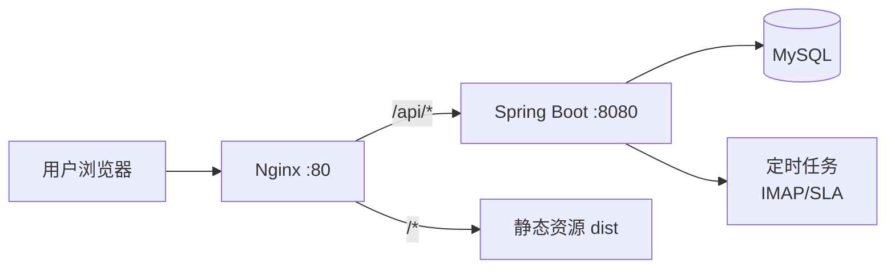

# MailTrace 邮迹工单 — 项目架构与规范

| 项目 | 说明 |
|------|------|
| 文档版本 | v0.4 |
| 编写日期 | 2026-07-22 |
| 文档状态 | 执行基线 |
| 产品名称 | **MailTrace（邮迹工单）** |
| 公司 | sfonda |
| 仓库模式 | **前后端同仓（Monorepo）** |
| 本地路径 | `/Users/tanzhixing/workSpace/sfd-mailtrace` |
| 后端包名 | `com.sfonda.mailtrace` |
| 表前缀 | `mt_` |
| 后端 | Java 21 + Spring Boot 3 |
| 前端 | React 19 + TypeScript 6 + Vite 8 |

> 本文档定义项目目录结构、技术选型、分层架构、接口规范、代码规范与部署方式。与需求文档、数据库设计配套使用。

---

## 1. 设计目标

| 目标 | 说明 |
|------|------|
| 部署简单 | 前后端同仓，一套 CI/CD、一个制品或可组合部署 |
| 边界清晰 | 后端按领域分包，前端按页面/模块组织 |
| 可演进 | 第一期可单体部署，后续模块可拆而不改目录习惯 |
| 规范统一 | API、错误码、日志、命名全项目一致 |

---

## 2. 技术栈

### 2.1 后端

| 类别 | 选型 | 版本建议 |
|------|------|---------|
| 语言 | Java | 21 |
| 框架 | Spring Boot | 3.5.x |
| ORM | MyBatis-Plus | 3.5.x |
| 数据库 | MySQL | 8.0 |
| 迁移 | Flyway | 最新稳定版 |
| 邮件 | Angus Mail / Jakarta Mail | — |
| 定时任务 | Spring `@Scheduled` | 第一期够用 |
| 鉴权 | Spring Security + JWT | — |
| 文档 | Springdoc OpenAPI | — |
| 工具 | Lombok、MapStruct | — |

### 2.2 前端

| 类别 | 选型 | 版本建议 |
|------|------|---------|
| 框架 | React | 19.2.x（以当前工程锁定版本为准） |
| 语言 | TypeScript | 6.0.x（以当前工程锁定版本为准） |
| 构建 | Vite | 8.1.x（以当前工程锁定版本为准） |
| 包管理 | pnpm | 10.x |
| UI | shadcn/ui + TailwindCSS | 4.x |
| 请求 | fetch 封装 | 自研薄封装 |
| 路由 | React Router | 7.x |
| 表单 | react-hook-form + zod | — |
| 图表 | Recharts | 第三期报表用 |

### 2.3 基础设施

| 类别 | 选型 |
|------|------|
| 容器 | Docker + Docker Compose |
| 反向代理 | Nginx（生产静态资源 + API 反代） |
| 配置 | 环境变量 + `application-{profile}.yml` |

---

## 3. 仓库结构（Monorepo）

```
sfd-mailtrace/                     # 项目根目录（仓库名）
├── README.md
├── .gitignore
├── docker-compose.yml             # 本地/生产一键启动
├── docker-compose.dev.yml         # 开发依赖（MySQL 等）
├── Makefile                       # 常用命令快捷入口（可选）
│
├── backend/                       # Java 后端（包名 com.sfonda.mailtrace）
│   ├── pom.xml
│   └── src/
│       ├── main/
│       │   ├── java/
│       │   └── resources/
│       └── test/
│
├── frontend/                      # React 前端
│   ├── package.json
│   ├── pnpm-lock.yaml
│   ├── vite.config.ts
│   └── src/
│
├── deploy/                        # 部署相关
│   ├── docker/
│   │   ├── backend.Dockerfile
│   │   ├── frontend.Dockerfile
│   │   └── nginx/
│   │       └── default.conf       # 前端静态 + /api 反代
│   └── scripts/
│       ├── build.sh
│       └── start.sh
│
└── docs/                          # 项目文档（可选，Obsidian 为主）
    └── api/
```

### 3.1 为什么这样拆

| 目录 | 职责 |
|------|------|
| `backend/` | 独立 Maven 工程，可单独 `mvn package` |
| `frontend/` | 独立 Node 工程，可单独 `pnpm build` |
| `deploy/` | 镜像构建、Nginx、启动脚本，**不把部署逻辑散落在业务代码里** |
| 根目录 `docker-compose.yml` | 一条命令拉起 MySQL + 后端 + 前端（Nginx） |

---

## 4. 部署架构

### 4.1 生产部署（推荐）



- **一个域名**：前端页面与 API 同域，避免 CORS 麻烦
- **Nginx**：
  - `/` → 前端 `dist`
  - `/api/` → 反代到 Spring Boot
- **后端** 内嵌或同 compose 跑定时任务（IMAP 拉信、SLA 检查）

### 4.2 Docker Compose 服务

```yaml
# 概念示意
services:
  mysql:      # 数据库
  backend:    # Spring Boot jar
  web:        # Nginx + frontend dist
```

### 4.3 本地开发

| 服务 | 地址 | 说明 |
|------|------|------|
| 前端 dev | http://localhost:5173 | Vite，代理 `/api` → 后端 |
| 后端 | http://localhost:8080 | context-path: `/api` |
| MySQL | localhost:3306 | docker-compose.dev 拉起 |

---

## 5. 后端架构

### 5.1 分层原则（DDD 轻量）

```
interfaces/          # 对外：Controller、VO、鉴权入口（不写业务逻辑）
application/         # 应用：BizService、编排、事务（业务逻辑在此）
domain/              # 领域：枚举、领域服务（可选，第一期可薄）
infrastructure/      # 基础设施：配置、安全、邮件、存储
repox/               # 仓储：Entity、Mapper、MyBatis Service（薄数据访问）
```

**分层职责（强制）：**

| 层 | 职责 | 禁止 |
|----|------|------|
| **Controller** | 参数接收、校验触发、调用 BizService、返回 `BasicResult` | ❌ 不写任何业务逻辑 |
| **BizService** | 业务编排、事务、规则判断、调用 repox/infrastructure | ❌ 不直接写 SQL |
| **repox** | CRUD、Mapper 调用 | ❌ 不写业务规则 |
| **Entity / VO** | 数据结构定义 | — |

> Service 层统一使用 `*BizService` 命名，放在 `application/bizservice/` 下。

### 5.2 Java 包结构

```
com.sfonda.mailtrace/
├── MailtraceApplication.java
│
├── interfaces/
│   ├── api/
│   │   ├── ticket/           # 工单
│   │   ├── mailbox/          # 邮箱配置
│   │   ├── rule/             # 分配/通知规则
│   │   ├── sla/              # SLA
│   │   ├── customer/         # 客户（轻量）
│   │   ├── dashboard/        # 工作台
│   │   └── system/           # 用户、模板、参数
│   └── vo/
│       ├── ticket/
│       ├── mailbox/
│       └── ...
│
├── application/
│   ├── bizservice/
│   │   ├── ticket/
│   │   ├── mailbox/
│   │   ├── rule/
│   │   ├── sla/
│   │   └── mail/
│   └── scheduler/
│       ├── MailFetchJob.java      # IMAP 拉信
│       └── SlaCheckJob.java       # SLA 超时检查
│
├── domain/
│   ├── ticket/
│   │   ├── TicketStatus.java
│   │   └── TicketEventType.java
│   ├── sla/
│   └── mail/
│
├── infrastructure/
│   ├── config/               # 数据源、MyBatis、Security
│   ├── security/             # JWT、当前用户
│   ├── mail/                 # IMAP/SMTP 客户端封装
│   ├── basic/                # 统一响应 BasicResult
│   └── exception/            # 全局异常
│
└── repox/
    └── mysql/
        ├── entity/
        ├── mapper/
        └── service/          # MyBatis-Plus Service（薄）
```

### 5.3 模块与需求映射

| 需求域 | Controller 包 | BizService | 表前缀建议 |
|--------|--------------|------------|-----------|
| 工单 | `ticket` | `TicketBizService` | `mt_ticket` |
| 邮件邮箱 | `mailbox` | `MailboxBizService` | `mt_mailbox` |
| 邮件网关 | —（scheduler + mail） | `MailFetchBizService` | `mt_mail_*` |
| 规则 | `rule` | `AssignmentRuleBizService` | `mt_rule` |
| SLA | `sla` | `SlaBizService` | `mt_sla` |
| 客户 | `customer` | `CustomerBizService` | `mt_customer` |
| 系统 | `system` | `UserBizService` 等 | `mt_sys_*` |

### 5.4 统一 API 约定

**基础路径：** `/api/v1`

**统一响应：**

```json
{
  "code": 0,
  "message": "ok",
  "data": {},
  "traceId": "abc123",
  "serverTime": "2026-07-21T19:00:00+08:00"
}
```

| 字段 | 说明 |
|------|------|
| `code` | `0` 成功，非 0 业务错误 |
| `message` | 提示文案 |
| `data` | 业务数据 |
| `traceId` | 链路追踪（与工单 traceID 不同概念） |

**分页：**

```json
{
  "code": 0,
  "data": {
    "items": [],
    "pageNo": 1,
    "pageSize": 20,
    "total": 100
  }
}
```

**REST 风格示例：**

| 方法 | 路径 | 说明 |
|------|------|------|
| GET | `/api/v1/tickets` | 工单列表 |
| GET | `/api/v1/tickets/{id}` | 工单详情 |
| POST | `/api/v1/tickets/{id}/reply` | 回复客户 |
| PUT | `/api/v1/tickets/{id}/assign` | 转派 |
| GET | `/api/v1/mailboxes` | 邮箱列表 |
| POST | `/api/v1/mailboxes/{id}/test-connection` | 测试连接 |

### 5.5 错误码规范

| 范围 | 含义 |
|------|------|
| `0` | 成功 |
| `400xx` | 参数/校验错误 |
| `401xx` | 未登录/鉴权失败 |
| `403xx` | 无权限 |
| `404xx` | 资源不存在 |
| `500xx` | 系统错误 |
| `510xx` | 邮件相关错误（IMAP/SMTP） |
| `520xx` | 工单业务错误 |

示例：`51001` IMAP 连接失败，`52001` 工单不存在。

### 5.6 数据库规范

- 表名：`mt_` 前缀 + 蛇形，如 `mt_ticket`
- 主键：`BIGINT` 自增或雪花（**全项目统一一种**）
- 时间：`created_at`、`updated_at`，`DATETIME(3)`
- 软删：`deleted` TINYINT，0 未删 1 已删（需要时）
- 迁移：Flyway，`V1__baseline.sql` 起

### 5.7 定时任务规范

| 任务 | 建议频率 | 说明 |
|------|---------|------|
| `MailFetchJob` | 每 1～3 分钟 | 拉取所有启用 Mailbox |
| `SlaCheckJob` | 每 5～10 分钟 | 扫描即将超时/已超时 |
| `MailRetryJob` | 每 5 分钟 | 发送失败重试（可选） |

- 任务必须**幂等**
- 记录执行日志到 `mt_job_log`
- 多实例部署时第一期可用 DB 锁或 `@SchedulerLock`（后续）

### 5.8 后端代码规范

#### 5.8.1 Lombok 使用规范

**统一使用 Lombok**，减少样板代码，禁止手写可替代的 getter/setter/构造器。

| 类型 | 推荐注解 | 说明 |
|------|---------|------|
| Entity | `@Data`、`@TableName` | 数据库实体 |
| VO / DTO | `@Data` | 接口入参/出参 |
| BizService | `@RequiredArgsConstructor` | 构造器注入，禁止 `@Autowired` 字段注入 |
| Controller | `@RequiredArgsConstructor` | 同上 |
| 日志 | `@Slf4j` | 需要打日志的类 |
| 枚举 | 手写或 `@Getter` | 枚举常量 |

**Entity 示例：**

```java
@Data
@TableName("mt_ticket")
@Schema(description = "工单")
public class TicketDO {

    @Schema(description = "主键 ID")
    private Long id;

    @Schema(description = "工单号")
    private String ticketNo;

    @Schema(description = "邮件主题")
    private String subject;

    @Schema(description = "客户邮箱")
    private String customerEmail;

    @Schema(description = "工单状态")
    private String status;

    @Schema(description = "创建时间")
    private LocalDateTime createdAt;
}
```

**BizService 示例：**

```java
@Slf4j
@Service
@RequiredArgsConstructor
public class TicketBizService {

    private final TicketMapper ticketMapper;
    private final MailSendBizService mailSendBizService;
}
```

#### 5.8.2 Swagger / OpenAPI 注释规范（强制）

使用 **Springdoc OpenAPI 3**（`io.swagger.v3.oas.annotations`）。

**必须加 Swagger 注释的类：**

| 类型 | 要求 |
|------|------|
| **Controller** | 类级 `@Tag`；每个接口方法 `@Operation`；入参 `@Parameter` / `@Schema` |
| **Entity** | 类级 `@Schema`；每个字段 `@Schema(description = "...")` |
| **VO（Request/Response）** | 类级 `@Schema`；每个字段 `@Schema` |

**Controller 示例：**

```java
@Tag(name = "工单管理", description = "工单列表、详情、回复、转派")
@RestController
@RequestMapping("/v1/tickets")
@RequiredArgsConstructor
public class TicketController {

    private final TicketBizService ticketBizService;

    @Operation(summary = "工单列表", description = "分页查询工单，支持按状态、处理人筛选")
    @GetMapping
    public BasicResult<PageResult<TicketItemVO>> list(@Valid TicketPageRequest request) {
        return BasicResult.ok(ticketBizService.queryPage(request));
    }

    @Operation(summary = "工单详情", description = "根据 ID 查询工单详情，含邮件往来与生命周期")
    @GetMapping("/{id}")
    public BasicResult<TicketDetailVO> detail(
            @Parameter(description = "工单 ID") @PathVariable Long id) {
        return BasicResult.ok(ticketBizService.getDetail(id));
    }

    @Operation(summary = "回复客户", description = "处理人通过系统回复客户，经 SMTP 发送邮件")
    @PostMapping("/{id}/reply")
    public BasicResult<Void> reply(
            @Parameter(description = "工单 ID") @PathVariable Long id,
            @Valid @RequestBody TicketReplyRequest request) {
        ticketBizService.replyToCustomer(id, request);
        return BasicResult.ok();
    }
}
```

**VO 示例：**

```java
@Data
@Schema(description = "工单回复请求")
public class TicketReplyRequest {

    @Schema(description = "回复内容", requiredMode = Schema.RequiredMode.REQUIRED)
    @NotBlank(message = "回复内容不能为空")
    private String content;
}
```

#### 5.8.3 Controller 层规范（强制）

Controller **只做接口适配**，不允许出现业务判断与数据处理。

**允许：**

- 接收并校验参数（`@Valid`）
- 调用 BizService 方法
- 包装 `BasicResult` 返回
- 获取当前登录用户 ID 并传给 Service（或通过上下文）

**禁止：**

- if/else 业务分支
- 直接调用 Mapper / Repository
- 组装复杂业务对象
- 事务注解（`@Transactional` 放在 BizService）

```java
// ✅ 正确：薄 Controller
@PostMapping("/{id}/reply")
public BasicResult<Void> reply(@PathVariable Long id, @Valid @RequestBody TicketReplyRequest request) {
    ticketBizService.replyToCustomer(id, request);
    return BasicResult.ok();
}

// ❌ 错误：Controller 里写业务逻辑
@PostMapping("/{id}/reply")
public BasicResult<Void> reply(@PathVariable Long id, @RequestBody TicketReplyRequest request) {
    TicketDO ticket = ticketMapper.selectById(id);
    if (ticket == null) throw new BizException(52001, "工单不存在");
    if ("CLOSED".equals(ticket.getStatus())) throw new BizException(52002, "工单已关闭");
    // ...
}
```

#### 5.8.4 BizService 层规范（强制）

所有业务逻辑写在 **BizService**，方法必须加 JavaDoc，复杂流程必须标注**业务步骤**。

**注释要求：**

| 项 | 要求 |
|----|------|
| 类注释 | 说明该 Service 负责的业务域 |
| 方法注释 | `@param`、`@return`、必要时 `@throws` |
| 业务步骤 | 多步骤方法内用 `// Step 1:`、`// Step 2:` 标注 |

**BizService 示例：**

```java
/**
 * 工单业务服务：建单、回复、转派、状态变更。
 */
@Slf4j
@Service
@RequiredArgsConstructor
public class TicketBizService {

    private final TicketMapper ticketMapper;
    private final TicketEventMapper ticketEventMapper;
    private final MailSendBizService mailSendBizService;

    /**
     * 处理人回复客户。
     *
     * @param ticketId 工单 ID
     * @param request  回复内容
     */
    @Transactional(rollbackFor = Exception.class)
    public void replyToCustomer(Long ticketId, TicketReplyRequest request) {
        // Step 1: 查询工单并校验状态
        TicketDO ticket = loadActiveTicket(ticketId);

        // Step 2: 保存回复记录
        saveReplyMessage(ticket, request.getContent());

        // Step 3: 通过 SMTP 发送邮件给客户
        mailSendBizService.sendCustomerReply(ticket, request.getContent());

        // Step 4: 更新工单状态与首次响应时间
        updateTicketAfterReply(ticket);

        // Step 5: 记录生命周期事件
        recordEvent(ticketId, TicketEventType.AGENT_REPLY, request.getContent());
    }

    /**
     * 根据客户来信创建工单。
     *
     * @param mailMessage 解析后的邮件对象
     * @return 新建工单
     */
    @Transactional(rollbackFor = Exception.class)
    public TicketDO createFromIncomingMail(IncomingMailMessage mailMessage) {
        // Step 1: 去重检查（Message-ID）
        // Step 2: 判断是否追信，关联已有工单
        // Step 3: 生成 ticketNo
        // Step 4: 保存工单与原始邮件
        // Step 5: 发送自动回执
        // Step 6: 执行分配规则并通知处理人
        // Step 7: 计算 SLA 截止时间
        // Step 8: 记录生命周期
    }
}
```

#### 5.8.5 各层注解清单（速查）

| 层 | 类注解 | 方法/字段注解 |
|----|--------|--------------|
| Controller | `@RestController`、`@RequestMapping`、`@Tag`、`@RequiredArgsConstructor` | `@Operation`、`@Parameter`、`@Valid` |
| BizService | `@Service`、`@Slf4j`、`@RequiredArgsConstructor` | `@Transactional`（需要时） |
| Entity | `@Data`、`@TableName`、`@Schema` | 字段 `@Schema`、`@TableId`、`@TableField` |
| VO | `@Data`、`@Schema` | 字段 `@Schema`、校验 `@NotBlank` 等 |
| Mapper | `@Mapper` | — |
| Scheduler | `@Component`、`@Slf4j` | `@Scheduled` |

#### 5.8.6 代码审查检查项（后端）

- [ ] Entity 每个字段有 `@Schema(description)`
- [ ] Controller 类有 `@Tag`，方法有 `@Operation`
- [ ] Controller 无业务逻辑、无 Mapper 调用
- [ ] BizService 方法有 JavaDoc，多步骤有 Step 注释
- [ ] 使用 Lombok，无手写 getter/setter
- [ ] 依赖注入使用 `@RequiredArgsConstructor`，非字段 `@Autowired`

---

## 6. 前端架构

### 6.1 目录结构

```
frontend/src/
├── main.tsx
├── app/
│   ├── App.tsx
│   ├── router/
│   │   └── index.tsx              # React Router 路由表
│   ├── layout/
│   │   ├── AppShell.tsx           # 侧栏 + 顶栏 + 内容区
│   │   ├── Sidebar.tsx
│   │   └── TopNav.tsx
│   ├── pages/
│   │   ├── dashboard/             # 工作台
│   │   ├── ticket/                # 工单中心
│   │   ├── customer/              # 客户与联系人
│   │   ├── mailbox/               # 邮件与邮箱
│   │   ├── rule/                  # 规则与分配
│   │   ├── sla/                   # SLA 与提醒
│   │   ├── report/                # 统计报表（第三期，可先占位）
│   │   ├── system/                # 系统管理
│   │   └── auth/
│   │       └── Login.tsx
│   ├── components/
│   │   ├── ui/                    # shadcn 基元
│   │   └── business/              # 业务组件
│   │       ├── TicketStatusBadge.tsx
│   │       └── SlaCountdown.tsx
│   └── hooks/
│       ├── useAuth.ts
│       └── useTicketList.ts
│
└── shared/
    ├── api/
    │   ├── http-client.ts         # fetch 封装、401 处理
    │   ├── endpoints.ts           # API 路径常量
    │   ├── ticket-api.ts
    │   ├── mailbox-api.ts
    │   └── ...
    ├── types/
    │   ├── ticket.ts
    │   └── api.ts                 # BasicResult<T>
    ├── config/
    │   └── runtime.ts             # 环境变量
    └── utils/
        ├── date.ts
        └── format.ts
```

### 6.2 路由规划（与菜单一致）

| 路径 | 页面 | 第一期 |
|------|------|--------|
| `/login` | 登录 | ✅ |
| `/dashboard` | 工作台 | ✅ |
| `/tickets` | 工单列表 | ✅ |
| `/tickets/:id` | 工单详情 | ✅ |
| `/customers` | 客户列表 | ✅ 轻量 |
| `/mailboxes` | 邮箱管理 | ✅ |
| `/mailboxes/:id` | 邮箱配置 | ✅ |
| `/rules` | 分配规则 | ✅ |
| `/sla` | SLA 设置 | ✅ |
| `/reports` | 统计报表 | ⏸ 占位 |
| `/system/users` | 用户管理 | ✅ |
| `/system/templates` | 通知模板 | ✅ |

### 6.3 前端规范要点

| 项 | 规范 |
|----|------|
| 组件 | 页面放 `pages/`，可复用放 `components/business/` |
| API | 禁止在页面里硬编码 URL，统一走 `shared/api/` |
| 类型 | 接口响应必须有 TS 类型，与后端 VO 对齐 |
| 状态 | 第一期：页面级 state + hooks；全局仅 auth/user |
| 表单 | react-hook-form + zod 校验 |
| 样式 | Tailwind + shadcn，禁止内联 style 除非动态计算 |
| 命名 | 组件 PascalCase，文件与组件同名 |

### 6.4 环境变量

```bash
# frontend/.env.development
VITE_API_BASE_URL=/api
VITE_APP_TITLE=邮件工单系统
```

```typescript
// vite.config.ts 开发代理
proxy: {
  '/api': 'http://127.0.0.1:8080'
}
```

---

## 7. 前后端协作规范

### 7.1 接口先行

1. 后端在 `interfaces/vo` 定义请求/响应结构
2. Springdoc 自动生成 OpenAPI：`/api/v3/api-docs`
3. 前端按 VO 手写 TS 类型（第一期不强制 codegen）

### 7.2 字段命名映射

| 后端（Java/JSON） | 前端（TS） | DB |
|------------------|-----------|-----|
| `ticketNo` | `ticketNo` | `ticket_no` |
| `createdAt` | `createdAt` | `created_at` |

- JSON 统一 **camelCase**
- 数据库统一 **snake_case**
- MyBatis 开启 map-underscore-to-camel-case

### 7.3 Git 分支（建议）

| 分支 | 用途 |
|------|------|
| `main` | 生产 |
| `develop` | 集成 |
| `feature/*` | 功能分支 |
| `fix/*` | 修复 |

提交信息：`feat(ticket): 工单列表查询`、`fix(mail): IMAP 连接超时`

### 7.4 PR 检查清单

**后端：**

- [ ] 接口返回 `BasicResult`
- [ ] Entity / Controller / VO 已加 Swagger 注释
- [ ] Controller 无业务逻辑，逻辑在 BizService
- [ ] BizService 方法有注释，复杂流程有 Step 步骤
- [ ] 使用 Lombok，构造器注入
- [ ] Flyway 迁移脚本（如有表变更）

**前端：**

- [ ] 类型与 API 模块已更新
- [ ] 本地 `pnpm build` / `mvn test` 通过

---

## 8. 安全规范

| 项 | 要求 |
|----|------|
| 鉴权 | JWT，Header：`Authorization: Bearer <token>` |
| 邮箱密码 | 加密存储（AES 或 KMS），禁止明文日志 |
| 接口 | 除 `/api/v1/auth/login` 外均需登录 |
| CORS | 生产同域部署，开发靠 Vite 代理 |
| 文件上传 | 限制类型与大小，附件存本地或 MinIO（第二期可选） |

---

## 9. 日志与监控

| 项 | 规范 |
|----|------|
| 日志框架 | SLF4J + Logback |
| 请求日志 | 记录 `traceId`、路径、耗时 |
| 邮件任务 | 每次拉信/发信记结果与错误原因 |
| 级别 | 生产 INFO，调试 DEBUG |

---

## 10. 常用命令（根目录）

```bash
# 启动开发依赖
docker compose -f docker-compose.dev.yml up -d

# 后端
cd backend && mvn spring-boot:run

# 前端
cd frontend && pnpm install && pnpm dev

# 全量构建
cd backend && mvn clean package -DskipTests
cd frontend && pnpm build

# 生产 compose
docker compose up -d --build
```

**Makefile 示例（可选）：**

```makefile
dev:
	docker compose -f docker-compose.dev.yml up -d
	cd backend && mvn spring-boot:run &
	cd frontend && pnpm dev

build:
	cd backend && mvn clean package -DskipTests
	cd frontend && pnpm build
```

---

## 11. 第一期实施顺序（架构视角）

| 顺序 | 模块 | 说明 |
|------|------|------|
| 1 | 工程骨架 | monorepo、Docker、统一响应、登录 |
| 2 | `mail-gateway` | IMAP/SMTP 封装 |
| 3 | `mailbox` + `ticket` | 邮箱配置、建单 |
| 4 | `ticket` 页面 | 列表、详情、回复 |
| 5 | `rule` + `sla` | 分配与超时 |
| 6 | `dashboard` | 工作台看板 |

---

## 12. 待定事项（评审时确认）

| 项 | 选项 | 建议 |
|----|------|------|
| 主键策略 | 自增 vs 雪花 | 自增（简单） |
| 附件存储 | 本地磁盘 vs MinIO | 第一期本地磁盘 |
| 多实例 | 单实例 vs 多副本 | 第一期单实例 |
| 消息队列 | 无 vs Redis/RabbitMQ | 第一期无，定时任务直连 |
| OpenAPI codegen | 手写 vs 生成 | 第一期手写 TS 类型 |

---

## 13. 文档修订记录

| 版本 | 日期 | 说明 |
|------|------|------|
| v0.1 | 2026-07-21 | 初稿：前后端同仓、Java + React 架构与规范 |
| v0.2 | 2026-07-21 | 补充后端规范：Swagger 强制、Controller 薄层、BizService 业务步骤注释、Lombok |
| v0.3 | 2026-07-22 | 正式定名 MailTrace：路径 sfd-mailtrace、包名 com.sfonda.mailtrace、表前缀 mt_ |
| v0.4 | 2026-07-22 | 谭总确认技术基线按当前工程执行：React 19、TypeScript 6、Vite 8 |
